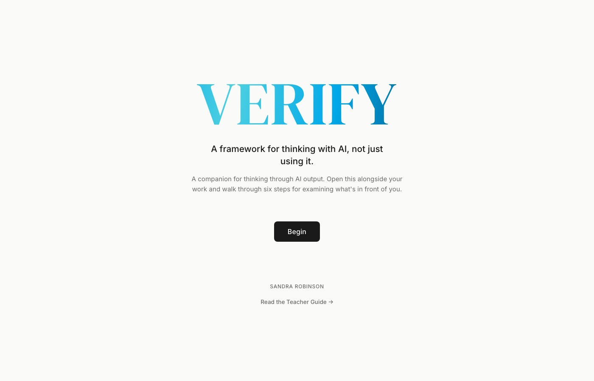

# Teaching AI to Ask: The VERIFY Framework

> *A framework for thinking with AI, not just using it.*

VERIFY is an AI literacy framework for secondary and adult learners and the people who teach them. It names six steps for working with AI output: **V**alidate, **E**xamine, **R**eflect, **I**nvestigate, **F**ilter, and **Y**our Judgement. The framework turns the easy act of accepting AI output into the harder, more useful act of interrogating it.

The framework is built on the finding that learners will not do that interrogation alone. They need a teacher, a mentor, or a structured conversation to make it happen. This repository gives you four ways to provide that structure.

## What's in this repository

| | What it is | Who it is for |
|---|---|---|
| [📘 **Teacher Guide**](guide/00-overview.md) | The framework's source of truth. Research foundation, classroom moves, worked examples in four subject areas, two assessment rubrics. | Teachers, curriculum leaders, researchers, anyone wanting the depth. |
| [🤖 **Claude skill**](skill/) | A `SKILL.md` file that turns any Claude project into a VERIFY-aware agent. Walks a learner through V to Y, explains why each step exists, generates teacher feedback. **The primary interactive experience.** | Students, adult learners, teachers, developers. Anyone with Claude. |
| [🖥️ **Interactive tool**](tool/) — [launch it](https://bigwellaadmin-dev.github.io/verify/) | A single-file HTML walk-through. Open the hosted version, or grab `tool/index.html` and run it locally. For classroom projection, LMS embedding, or use without Claude. | Teachers running a class, schools embedding in Moodle / Canvas, anyone without an AI account. |
| [🧰 **Rubrics**](rubrics/) | A to E (QCAA-aligned) and four-level versions of the VERIFY assessment rubric. | Teachers designing assessment. |

## The Claude skill is the headline experience

If you take one thing from this repository, take the skill.

**Why.** People do not reliably open peripheral tools. They use the tools they already have. If you (or your students) already use Claude, the skill turns Claude into a VERIFY-aware mentor in any conversation. It guides, explains why each step exists, asks follow-up questions, and refuses to let thin answers pass. It produces the teacher-conversation a written tool cannot.

**How to install.** Copy `skill/VERIFY_skill.md` into your Claude project as a file or paste its content into the project's custom instructions. The skill loads automatically when you say things like "review this with VERIFY", "walk me through VERIFY on this", or "give me VERIFY feedback for this student work."

**Before you install, read [`skill/README.md`](skill/README.md).** It addresses the recursive question this framework raises about distributing itself as an AI skill. The honesty is part of how the skill is meant to be used.

## How the framework is meant to land

VERIFY is a teaching framework. It requires someone present who is willing to ask the awkward questions. In the skill, Claude plays that role. In a classroom, a teacher plays it. Either way, the framework only produces learning when the questions get asked and the answers get interrogated.

The interactive tool in `tool/` is a structured walk-through designed for the cases the skill cannot reach: a teacher projecting in front of a class, an LMS embedding the framework in a Moodle or Canvas course, a learner who does not have a Claude account. It produces a filter log a teacher can review, but the conversation that matters still happens with a person.

If you adapt the tool or the skill for a different use case (asynchronous reflection, professional learning for adults, a different cognitive scaffold), please make that explicit in your adaptation.

## Quick start

### For anyone working through their own AI output

1. Open Claude and create a project (or use an existing one).
2. Upload [`skill/VERIFY_skill.md`](skill/VERIFY_skill.md) to the project, or paste its content into the project's custom instructions.
3. Paste your AI output and ask "walk me through VERIFY on this." Claude takes it from there.

### For teachers

1. Read [**Part 1 of the Teacher Guide**](guide/01-the-problem.md) first. It explains why the framework is built the way it is. About 15 minutes.
2. Pick one letter to introduce. Read the matching section in [Part 2](guide/02-the-framework.md) and the matching teacher moves in [Part 3](guide/03-in-practice.md).
3. Choose your delivery: the [Claude skill](skill/) for individual student conversations, the [interactive tool](tool/) for whole-class projection or LMS embedding.
4. Use the [A to E rubric](rubrics/verify-rubric-a-to-e.md) or [four-level rubric](rubrics/verify-rubric-four-level.md) to assess the process.

### For curriculum leaders and researchers

1. Read [Part 1](guide/01-the-problem.md) and the [Appendix](guide/appendix-research.md) for the research base.
2. Cite using [`CITATION.cff`](CITATION.cff). GitHub's "Cite this repository" button generates a clean reference from it.

### For developers integrating Claude

1. Copy [`skill/VERIFY_skill.md`](skill/VERIFY_skill.md) into your Claude project, your Agent SDK system prompt, or wherever you load skills.
2. The skill includes three modes (learner guidance, work review, teacher feedback generation) and pedagogical breaks that teach the framework as it runs.

## How the artefacts work

### The Claude skill

Self-contained. Drop the file in, Claude becomes VERIFY-aware. No dependencies, no setup, works with any Claude surface (Claude.ai projects, Desktop, Code, Agent SDK). The skill carries the full framework, three application modes, the feedback-language matrix, and explanatory breaks that turn the framework from a checklist into something the learner is doing on purpose.

### The interactive tool

- **Single file.** `tool/index.html` is one HTML file. Open it in any modern browser. No build step, no install.
- **No backend.** No server, no database, no telemetry, no account.
- **No data persistence.** Responses live in browser memory only. Refreshing clears everything. The export is the only way to save.
- **Three export options.** Download the filter log as a `.txt` file, save as PDF via the print dialog, or copy to clipboard.
- **Embeddable.** The CSP permits iframe embedding in Moodle, Canvas, and other LMS platforms.
- **Offline-capable.** Fonts are self-hosted alongside the tool. The page loads with no third-party network requests.
- **Accessible.** WCAG 2.1 AA contrast. Keyboard-navigable. Honours `prefers-reduced-motion`.

## Privacy

Neither the skill nor the tool collects, stores, or transmits anything about the user. There is no analytics, no telemetry, no cookies, no `localStorage`, no `sessionStorage`. The tool makes no third-party network requests — fonts are bundled in `tool/fonts/` under the SIL Open Font Licence. The skill runs entirely inside the user's existing Claude conversation under whatever privacy terms apply to their Claude account.

## Citation

If you use VERIFY in research, curriculum, or another publication, please cite:

> Robinson, S. (2026). *Teaching AI to Ask: The VERIFY Framework, Teacher Guide*. Big Wella. https://github.com/bigwellaadmin-dev/verify

Or use the machine-readable [`CITATION.cff`](CITATION.cff). GitHub, Zotero, and most reference managers will read it automatically.

## Licence

Released under [Creative Commons Attribution 4.0 International (CC BY 4.0)](LICENSE).

You are free to share and adapt the material for any purpose, including commercially, as long as you give appropriate credit. Attribution to *Sandra Robinson · Big Wella* with a link to this repository satisfies the licence.

## Contributing

This is a first public release. Issues, classroom-tested suggestions, translations, and improvements to the tool or skill are welcome. Please open an issue before submitting substantive changes to the framework content. The framework text is canonical and changes need to be considered carefully.

## Acknowledgements

Built on foundational work in cognitive science (the Law of Less Work, productive struggle, metacognitive laziness), Meta-Task Awareness research (Corvinus University of Budapest, 2024), Australian equity-in-AI research (Australian Public Policy Institute, 2024), and decades of practitioner wisdom about what it takes to teach thinking. Full sources in the [Appendix](guide/appendix-research.md).

---

*Sandra Robinson · Big Wella · 2026*
